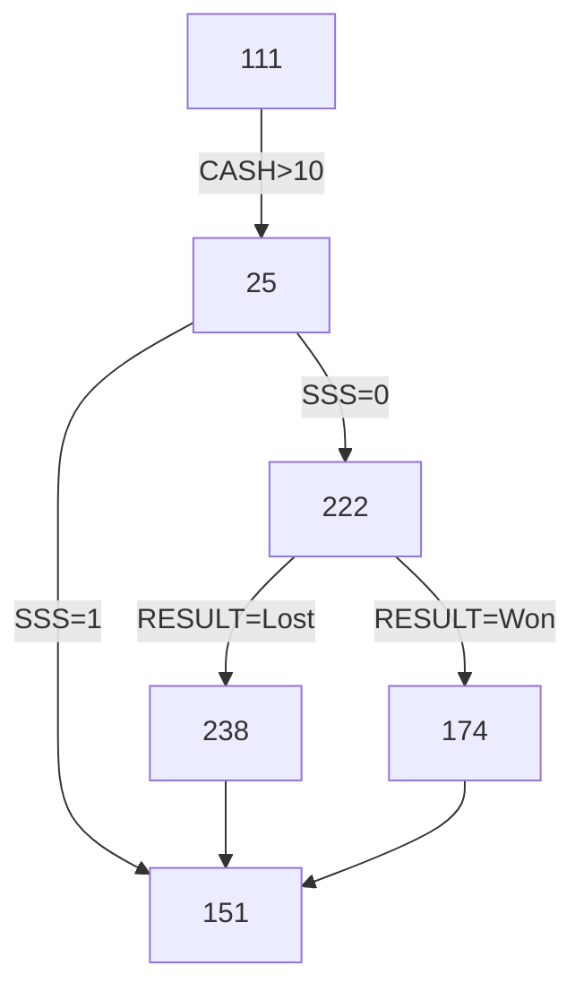

<!--suppress ALL -->

<p align="center">
    <a href="https://www.ninergames.com/" target="_blank">
        
    </a><br />
</p>

<h1 align="center">Paragraph Game's Engine in HTML</h1><br />

This document explains actual HTML implementation of our paragraph game's protocol. You should read it through, if you plan
to use HTML, CSS and JS source code stored within this repository in your own framework, programming language or solution.

If, on the other hand, you'd like to understand the protocol itself (to i.e. implement it in your own source code or your
own programming language that i.e. doesn't use JavaScript at all) then you should rather follow to [our Wiki](https://github.com/niner-games/tech-html-paragraph-game-engine/wiki) instead.

This is a HTML implementation of our paragraph game's engine. It is 100% aimed to be working in pure JavaScript / bare-bone
web browsers (no node.js needed etc.). Therefore there are slight things and issues that must be worked out when re-using
this source code in some mobile apps framework etc. See below for details.

- [General Information](#general-information)
    * [Simplicity](#simplicity)
    * [Pure JS Code](#pure-js-code)
- [Developer Tools](#developer-tools)
    * [JavaScript](#javascript)
    * [JSON](#json)
    * [CSS and HTML](#css-and-html)
    * [Markdown](#markdown)
    * [Base64](#base64)
- [Diagrams](#diagrams)
    * [Example](#example)
    * [Source code](#source-code)
    * [Tools](#tools)
- [Releases](#releases)

This in-line ToC has been generated using [GitHub Wiki TOC generator](https://ecotrust-canada.github.io/markdown-toc/).

# General Information

## Simplicity

We aim for a maximum simplicity:

1. Edit [_js/autoloader.js_](https://github.com/niner-games/tech-html-paragraph-game-engine/blob/main/js/autoloader.js) file and:

   - Change `languages` group and entries in [_data/translations.js_](https://github.com/niner-games/tech-html-paragraph-game-engine/blob/main/data/translations.js) file to modify list of supported languages
   - Change `themes` and corresponding files in [_css_](https://github.com/niner-games/tech-html-paragraph-game-engine/tree/main/css) folder to modify number of supported Bootstrap themes

2. Modify entries in [_data/chapters.js_](https://github.com/niner-games/tech-html-paragraph-game-engine/blob/main/data/chapters.js), [_data/settings.js_](https://github.com/niner-games/tech-html-paragraph-game-engine/blob/main/data/settings.js) and [_data/translations.js_](https://github.com/niner-games/tech-html-paragraph-game-engine/blob/main/data/translations.js) files to provide whole new story.

And you are ready to go with a new game in browser.

Adjust things mentioned below and you should be ready to go with a new game in your framework.

## Pure JS Code

This repository uses a pure JavaScript code that allows you to run game directly in a browser. It doesn't make use of any
super-duper things that TypeScript, Node.js or framework introduces (like dynamic files inclusion or file contents merging)
and a way more cool stuff available there.

Therefore, before compiling this repository (or game based on it) in your favourite coding language or framework, you need 
to strip certain things off.

Things to consider:

1. Pure JavaScript cannot read JSON files stored locally:

    - The [_data/chapters.js_](https://github.com/niner-games/tech-html-paragraph-game-engine/blob/main/data/chapters.js) and [_data/translations.js_](https://github.com/niner-games/tech-html-paragraph-game-engine/blob/main/data/translations.js) are not pure JSON files, but a JavaScript scripts with a typical JavaScript object implementation inside
    - You must to strip things like `let Translations = ` of and add quotes to keys like `en` or `pl` turning JS object into JSON file, if you want to use pure JSON files
    - You need to adjust code in [_js/chapter-engine.js_](https://github.com/niner-games/tech-html-paragraph-game-engine/blob/main/js/chapter-engine.js) and [_js/translation-engine.js_](https://github.com/niner-games/tech-html-paragraph-game-engine/blob/main/js/translation-engine.js) files (and possibly [_js/autoloader.js_](https://github.com/niner-games/tech-html-paragraph-game-engine/blob/main/js/autoloader.js) file too) to make it read translations (and chapters) from JSON files correctly (if you want that)

2. You need to... well... never mind... this is just a placeholder.

On the other hands, you may use this entire code as-is, if it only compiles in your framework as expected.

## Firefox

The aim of this repository is to provide **working business model** only, not a final product. You can use this code to run
our (or yours) games in a browser, but we are producing our games (even in web version) through some frameworks, based on this
code, not directly from this repository.

Even so, we have checked that this code works and can be used directly in every modern web browser... except for Firefox.

Turns out that Firefox is [a mentally retarded web browser](https://onezeronull.com/2023/11/03/localstorage-vs-firefox/).
As explained in the linked article, [**it doesn't share values stored in _localStorage_ between files**](https://stackoverflow.com/q/78146699/1469208)!

This means that you will go to [Settings page](https://github.com/niner-games/tech-html-paragraph-game-engine/blob/main/settings.html),
change theme, font or language, go back to [menu](https://github.com/niner-games/tech-html-paragraph-game-engine/blob/main/menu.html)
or [paragraph](https://github.com/niner-games/tech-html-paragraph-game-engine/blob/main/paragraph.html) and... your settings won't be reflected.

Pity you... if you are still using this weird browser. [There's not much that we can do about this](https://stackoverflow.com/a/79152899/1469208). For this and many, many other stupid bugs or mentally retarded decisions made by Mozilla, like above, I stopped
using this browser 20+ years ago.

# Developer Tools

## JavaScript

We are assuming that our code is as perfect and as pure as possible (right! :), but... if not... then...

* [ValidateJavaScript](https://validatejavascript.com/): as name says, good and challenging JavaScript linter
* [JSCompress](https://jscompress.com/): strong JavaScript compressor (works on in-line code or uploaded files)

## JSON

If you want to play with game's JSON files using some nifty tools instead of hand-writing it in Notepad! :)

- JSONCompare:
    - [One file or doc](https://jsoncompare.com/#!/simple/): beautify, minify, sort, save (for sharing) and lint
    - [Two files or docs](https://jsoncompare.com/#!/diff/): compare
- [JSON Editor Online](https://jsoneditoronline.org/):
    - Edit JSON files in fully WYSIWYG mode with a lot of useful tools
    - Whole JSON or selected part can be edited as: plain text, tree or table
    - Save JSON data to cloud (1 MB limit) or to file, send as URL, export to CSV where possible    
    - [For 3 USD per month](https://jsoneditoronline.org/pricing/) you get add-free and for 6 USD per month you can save private JSONs to the cloud
- [JSON Studio](https://jsonstudio.io/):
    - Is slow and has some bugs, but also has some fabulous features
    - Can minify and format (beautify) JSON with one click (_Others_ button)
    - Tracks history of your edits which can save your ass in some situations
    - Can render JSON as a [graphic tree](https://jsonstudio.io/view/json-crack-viewer) (click _Zoom+_ or _Zoom-_ if nothing seems rendered)
    - Can render JSON as [an expandable table / grid](https://jsonstudio.io/view/json-grid-viewer) (for nested objects has a bug and shows only first column)
    - Can generate [a class diagram of DB structure](https://jsonstudio.io/view/json-db-viewer) (with relations!) to store your JSON in database
    - Can [convert](https://jsonstudio.io/convert/JSON-to-CSV-Converter) between JSON, YAML and CSV both ways (nested objects can't be exported to CSV)
    - Also can [compare two JSONs](https://jsonstudio.io/json-diff-checker) and look for possible differencies
- [JSON Viewer](https://jsonviewer.ai/) can only validate correctness of a JSON and beautify it

## CSS and HTML

Some other optimizers and validators, if someone would still dare to claim that our code isn't perfect (right! :)

- Scan your website for [unused CSS selectors](https://www.jitbit.com/unusedcss/) scanner to find all obsolete CSS selectors
- Scan your HTTPS-website [to find any non-HTTPS served images](https://www.jitbit.com/sslcheck/) that may trigger a "mixed content" warning
- This is a website crawler; it starts with provided URL, and then follows all found links recursively to scan all pages

## Markdown

Markdown isn't currently support in our paragraph games, but it will most likely be supported soon. Only a very basic set
of Markdown will used, i.e. limited to simple text formatting only. No embed images, links, tables etc.

GitHub itself has a great Markdown support. But when writing large texts, it is often tiring to constantly switch between editor and preview.

In this case [StackEdit](https://stackedit.io/app#) can be a good replacement:

- Renders Markdown as you type
- Has reach Markdown editor; source colouring and formatting helps editing quicker
- Supports many keyboards (default are weird, but can be overwritten in settings)
- Supports workspaces and folders, allows to work over many files at all
- Can publish documents (as Markdown and HTML) to GitHub, Wordpress, Google Drive, Zendesk and more
- Able to synchronize workspaces accross devices and users using various sync services
- Can import and export Markdown or HTML; export to many formats [through Pandoc](https://pandoc.org/index.html) is limited to paid users
- Has a handy document's table of contents and Markdown cheatsheet
- Supports simple templates for exporting and publishing
- When rendering live, offers full support for MermaidJS diagrams [see below](#example)

This is especially important when editing wiki pages, which seems to be a secondary-citizen to GitHub and most valuable functions (that works in repos and issues) doesn't work here (like no support for keyboard shortcuts etc).

## Base64

We don't plan to use Base64-encoding in our game at this point. If ever changing mind then... [Base64.Guru](https://base64.guru/) rules!

- [Encode](https://base64.guru/converter/encode) Base64 from:
    - Strings: [text](https://base64.guru/converter/encode/text), [URL](https://base64.guru/converter/encode/url), [HTML](https://base64.guru/converter/encode/html), [hex](https://base64.guru/converter/encode/hex) and [CSS styles](https://base64.guru/converter/encode/css)
    - Binary: [image](https://base64.guru/converter/encode/image), [audio](https://base64.guru/converter/encode/audio), [video](https://base64.guru/converter/encode/video), [PDF](https://base64.guru/converter/encode/pdf) and any [other file type](https://base64.guru/converter/encode/file)
- [Decode](https://base64.guru/converter/decode) Base64 to:
    - Strings: [text](https://base64.guru/converter/decode/text), [hex](https://base64.guru/converter/decode/hex)
    - Binary: [image](https://base64.guru/converter/decode/image), [audio](https://base64.guru/converter/decode/audio), [video](https://base64.guru/converter/decode/video), [PDF](https://base64.guru/converter/decode/pdf) and [file](https://base64.guru/converter/decode/file)
- [Play](https://base64.guru/tools/):
    - [Validate](https://base64.guru/tools/validator) or [repair](https://base64.guru/tools/repair) Base64 string
    - [Convert data URL](https://base64.guru/tools/data-url-to-image) to image (uri-image) to a file
    - [Normalize](https://base64.guru/tools/normalization) it, to safely sent it via email (MIME) or use as file name or as a part of URL (Base64URL)

Also quick guides on how to work on Base64 in: [Javascript](https://base64.guru/developers/javascript), [PHP](https://base64.guru/developers/php) or how to embed [data-uri](https://base64.guru/developers/data-uri) into a [HTML document](https://base64.guru/developers/html).

# Diagrams

For this particular repository (game's engine implementation in HTML) we _may_ use some of the following tools directly 
in source code. To i.e. present player a path that he had already played through (and in debug mode, to render the entire
chapters set).

For some actual game implementation (in separate repository) we can use [MermaidJS tool for JavaScript](https://mermaid.js.org/) across entire
GitHub (in [issues](https://github.com/ninergames/test-renpy-engine/issues/23), [discussions](https://github.com/ninergames/test-renpy-engine/discussions/21) and [in text files](https://github.com/ninergames/test-renpy-engine)), for an actual game implementation process. I.e. drawing
diagrams to depict pieces of the game etc. (see below example).

## Example



The `174` item is clickable and points to → [https://mermaid.live/edit](https://mermaid.live/edit).

## Source code

Pure MermaidJS code needed to generate the above diagram is:

```
flowchart TD
    111 --> |CASH > 10| 25
    25 --> |SSS = 1| 151
    25 --> |SSS = 0| 222
    222 --> |RESULT = Won| 174
    222 --> |RESULT = Lost| 238    
    238 --> 151
    174 --> 151
    click 174 href "https://mermaid.live/edit
```

If you don't need clarify in reading, you may minify the above, by replacing new-lines with `;` and removing most spaces:

```
flowchart TD;111-->|CASH>10|25;25-->|SSS=1|151;25-->|SSS=0|222;222-->|RESULT=Won|174;222-->|RESULT=Lost|238;238-->151;174-->151; click 174 href "https://mermaid.live/edit"
```

Resulting in a nice one-liner. Which you can put anywhere you wish (issue, discussion, wiki):

    ```mermaid
    flowchart TD;111-->|CASH>10|25;25-->|SSS=1|151;25-->|SSS=0|222;222-->|RESULT=Won|174;222-->|RESULT=Lost|238;238-->151;174-->151; click 174 href "https://mermaid.live/edit"
    ```
## Tools

- At <https://mermaid.live/edit> there's an on-the-fly editor which render MermaidJS code as you type it
- Use [mermaid.ink Generator](https://mermaid.ink/) to "convert" (render) MermaidJS code it into an image and data-uri string.

# Releases

I never remember about this so I always give myself a "note to future self" at the end of each repository's read-me file!

All the details are given in [Git Basics - Tagging](https://git-scm.com/book/en/v2/Git-Basics-Tagging) and [Managing releases in a repository](https://docs.github.com/en/repositories/releasing-projects-on-github/managing-releases-in-a-repository).

In short:

1. Make a tag:
    * For exiting commit:
        * List all commits: `git log --pretty=oneline`
        * Pick the one you wish to tag (first seven letters of the has are enough), i.e.: `32c274c`
        * Add a tag: `git tag -a 0.1 32c274c -m "First version before general refactor"`
    * For latest commit: `git tag -a 1.4 -m "My version 1.4"`
    * Please, **do not** use `v1.0` scheme;
        * A version is a version, no need to prepend number with `v`
        * Even if [GitHub claims](https://github.com/akademia-slaska/template-repository/releases/new) that this is a common practice to do so
    * Use [Semantic Versioning 2.0.0](https://semver.org/) (three numbers) whenever possible
2. Push tag(s) to GitHub: `git push --tags`
3. Create [a new release](https://github.com/akademia-slaska/template-repository/releases/new): pick a tag, add title and a description, add some binaries, set options
4. Publish a release or save it as a draft.

GitHub **always adds a source code** to release. We **must always treat** all our releases **purely as private**.

Note that `git push --tags` pushes tags **only**. If you have some unpushed commits in the same time, you should send them next, using regular `git push`.
